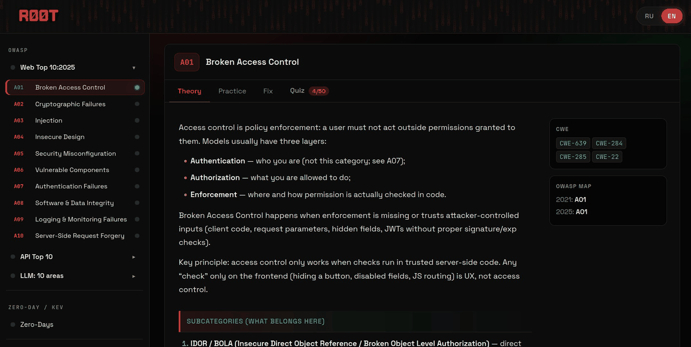
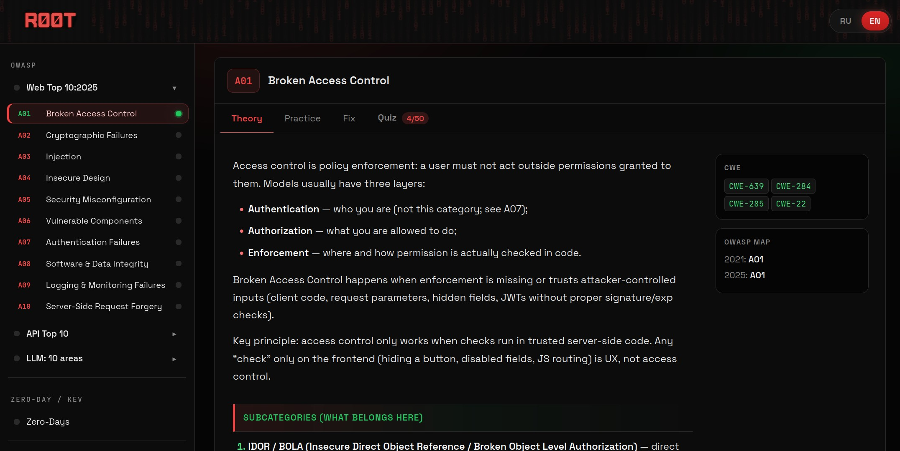
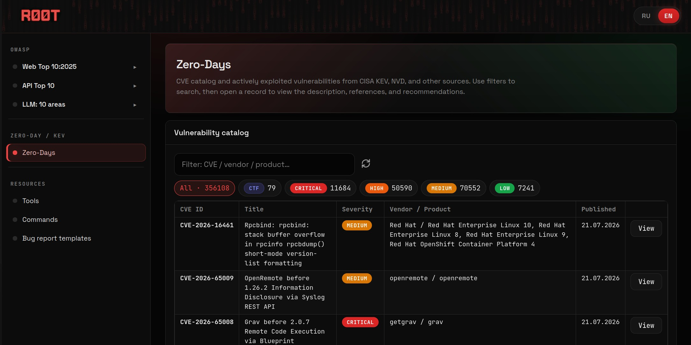

<div align="center">


# RØOT

### Ломай безопасно. Исправляй правильно.

Автономный AppSec-полигон для практики OWASP, браузерных CTF-задач,
исправления кода и исследования открытых данных CVE.

[**Демо**](https://madnessbrainsbl.github.io/ROOT/ru/) ·
[**Открыть приложение**](https://madnessbrainsbl.github.io/ROOT/app/) ·
[**English**](README.md)

[](https://github.com/madnessbrainsbl/ROOT/actions/workflows/ci.yml)


</div>

## Хватит просто читать об уязвимостях

RØOT превращает тему безопасности в повторяемый процесс: поймите границу
доверия, проэксплуатируйте контролируемую браузерную симуляцию, сравните
уязвимый и исправленный код, получите флаг и закрепите материал тестом.

Встроенное приложение работает локально. Ему не нужны SaaS-аккаунт, API-токен,
облачная лаборатория, аналитика или живая цель.

| Состав v0.1.0 | Проверенное количество |
|---|---:|
| Web CTF-задачи | 30 |
| Мини-лаборатории OWASP API Security | 10 |
| Двуязычные вопросы | 500 |
| Открытые записи CISA KEV/CVE List V5 | 250 |
| Справочные security-инструменты | 359 |
| Payload-примеры в 66 категориях | 1 224 |
| Сценарии цепочек атак | 108 |
| Сборщики команд | 59 |



## Что можно делать

- Изучать Web Top 10 с CWE и практическим контекстом.
- Проходить безопасные Web- и API-симуляции с подсказками и баллами.
- Сравнивать уязвимый код с конкретным исправлением.
- Искать в локальном публичном CVE-снимке по ID, вендору, продукту и severity.
- Использовать payloads, attack chains, command builders, чек-листы, SQL и
  шаблоны отчётов.
- Хранить прогресс и заметки в браузере и экспортировать их в JSON.



## Быстрый старт

Требования: Python 3.10+ и современный браузер.

```powershell
git clone https://github.com/madnessbrainsbl/ROOT.git
cd ROOT
python serve.py
```

Откройте <http://127.0.0.1:8080/> для лендинга или
<http://127.0.0.1:8080/app/> для самого приложения.

### Docker

```bash
docker compose up --build
```

Контейнер открывает <http://127.0.0.1:8080> и создаёт SQLite в отдельной
временной файловой системе. Секреты и внешние токены не нужны.

## Данные CVE и offline-режим

В RØOT входит небольшой снимок из 250 недавно добавленных записей CISA Known
Exploited Vulnerabilities. Опубликованные записи CVE List V5 дополняют их
данными CNA, если они доступны.

- Источники и SHA-256: [`data/cves_public.provenance.json`](data/cves_public.provenance.json)
- Воспроизводимый генератор: [`scripts/build_cve_seed.py`](scripts/build_cve_seed.py)
- Сторонние условия: [`THIRD_PARTY.md`](THIRD_PARTY.md)

Явное обновление для сопровождающих проекта:

```powershell
python scripts/build_cve_seed.py --limit 250
```

Приложение ничего не загружает при старте и не имеет endpoint для токенов или
обновления. Python-сервер использует SQLite, а GitHub Pages фильтрует тот же
JSON-снимок прямо в браузере.



## Архитектура

```text
Браузер (Vanilla JS)
├── Учебные треки Web / API / LLM
├── CTF-симуляции, тесты, tools, payloads и отчёты
├── Рабочая база sql.js + прогресс в браузере
└── GET /api/cves → Python stdlib server → SQLite
```

У Python-runtime нет сторонних пакетов. Данные frontend разделены по предметным
областям без bundler и фреймворка.

### Read-only API

```text
GET /api/health
GET /api/cves/status
GET /api/cves?severity=CRITICAL&q=apache&limit=50&offset=0
GET /api/cves/counts
GET /api/cves/{CVE-ID}
```

## Ограничения

- RØOT — учебный симулятор, а не сканер уязвимостей.
- CVE-снимок не является полной или оперативной threat-intelligence базой.
- Прогресс привязан к текущему профилю браузера.
- Важные сведения о CVE нужно проверять по advisory вендора.

## Участие и ответственное использование

Перед отправкой изменений прочитайте [CONTRIBUTING.md](CONTRIBUTING.md),
[SECURITY.md](SECURITY.md) и [DISCLAIMER.md](DISCLAIMER.md). Применяйте материал
только к собственным системам или при наличии явного разрешения.

Проект распространяется по Apache-2.0. Атрибуции находятся в
[THIRD_PARTY.md](THIRD_PARTY.md) и каталоге [`licenses/`](licenses/).
